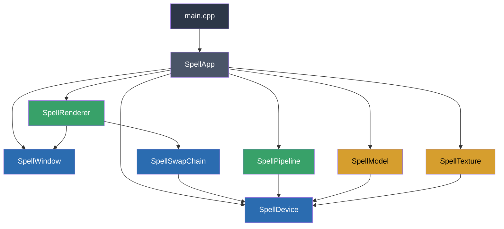
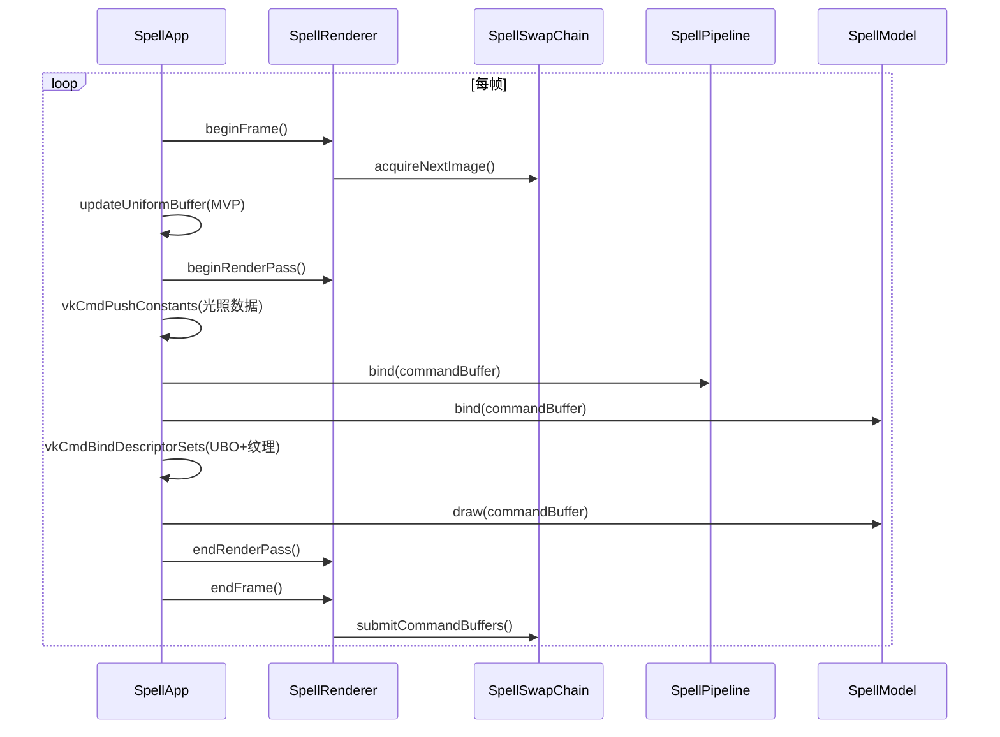

# Spell Engine

一个基于 **Vulkan API** 的轻量级 3D 渲染引擎，使用 C++17 编写。支持 OBJ 模型加载、纹理贴图、Mipmap、MSAA 多重采样抗锯齿、Uniform Buffer、Push Constants 以及基础的方向光照。

---

## 功能特性

- **Vulkan 渲染管线** — 完整的图形管线创建，支持动态 Viewport / Scissor
- **OBJ 模型加载** — 通过 tinyobjloader 加载 `.obj` 格式的 3D 模型
- **纹理系统** — 支持图片纹理加载，自动生成 Mipmap，Sampler 过滤
- **MSAA 抗锯齿** — 自动检测 GPU 最大可用采样数，多重采样抗锯齿
- **Uniform Buffer Object** — MVP 矩阵变换（Model / View / Projection）
- **Push Constants** — 片段着色器中的实时光照参数传递
- **交换链重建** — 窗口大小变化时自动重建 Swap Chain
- **Validation Layer** — Debug 模式下启用 Vulkan 验证层

---

## 项目结构

```
Spell/
├── shaders/                    # GLSL 着色器
│   ├── shader.vert             # 顶点着色器 (MVP 变换)
│   ├── shader.frag             # 片段着色器 (纹理采样 + 光照)
│   ├── vert.spv                # 编译后的 SPIR-V
│   ├── frag.spv
│   └── compile.bat             # 着色器编译脚本
├── textures/                   # 纹理资源
│   └── viking_room.png
├── src/
│   ├── main.cpp                # 入口
│   ├── SpellApp.h/cpp          # 应用层 (管线布局、描述符、渲染循环)
│   ├── core/                   # 核心 Vulkan 封装
│   │   ├── SpellWindow.h/cpp   # GLFW 窗口管理
│   │   ├── SpellDevice.h/cpp   # Vulkan 设备 (实例/物理设备/逻辑设备/命令池)
│   │   └── SpellSwapChain.h/cpp# 交换链 (帧缓冲/渲染通道/同步对象/深度/MSAA)
│   ├── renderer/               # 渲染器
│   │   ├── SpellRenderer.h/cpp # 帧管理 (beginFrame/endFrame/命令缓冲)
│   │   └── SpellPipeline.h/cpp # 图形管线 (着色器模块/管线状态配置)
│   └── resources/              # 资源管理
│       ├── SpellModel.h/cpp    # 模型加载 (顶点/索引缓冲，OBJ 解析)
│       └── SpellTexture.h/cpp  # 纹理加载 (图片读取/Mipmap 生成/采样器)
├── Spell.vcxproj               # Visual Studio 项目文件
└── Spell.props                 # 依赖库路径配置 (属性表)
```

---

## 架构概览



---

## 渲染流程



---

## 依赖项

| 库 | 用途 | 版本/说明 |
|---|---|---|
| [Vulkan SDK](https://vulkan.lunarg.com/) | 图形 API | 1.4.341.0 |
| [GLFW](https://www.glfw.org/) | 窗口与输入 | lib-vc2019 |
| [GLM](https://github.com/g-truc/glm) | 数学库 (矩阵/向量) | Header-only |
| [stb_image](https://github.com/nothings/stb) | 图片加载 | Header-only |
| [tinyobjloader](https://github.com/tinyobjloader/tinyobjloader) | OBJ 模型加载 | Header-only |

---

## 环境配置

### 前置要求

- Windows 10/11
- Visual Studio 2019+（需要 C++17 支持）
- Vulkan SDK 已安装
- 支持 Vulkan 的 GPU 及驱动

### 配置依赖路径

项目使用 `Spell.props` 属性表管理依赖路径。有两种配置方式：

**方式一：设置环境变量**

设置环境变量 `DEV_LIBS` 指向第三方库根目录，目录结构如下：

```
DEV_LIBS/
├── glfw/
│   ├── include/GLFW/
│   └── lib-vc2019/
├── glm/
├── stb/
├── tinyobjloader/
└── imgui/          (可选)
```

**方式二：直接修改 `Spell.props`**

编辑 `Spell.props` 中的路径宏：

```xml
<DEV_LIBS>E:\DevLibs</DEV_LIBS>
<VULKAN_SDK>C:\VulkanSDK\1.4.341.0</VULKAN_SDK>
```

### 编译着色器

进入 `shaders/` 目录，修改 `compile.bat` 中的 Vulkan SDK 路径后执行：

```bat
%VULKAN_SDK%\Bin\glslc.exe shader.vert -o vert.spv
%VULKAN_SDK%\Bin\glslc.exe shader.frag -o frag.spv
```

### 构建与运行

1. 用 Visual Studio 打开 `Spell.sln`
2. 确认配置为 `Debug|x64` 或 `Release|x64`
3. 构建并运行 (F5)

---

## 着色器说明

### 顶点着色器 (`shader.vert`)

- **输入**：位置 (`vec3`)、颜色 (`vec3`)、纹理坐标 (`vec2`)、法线 (`vec3`)
- **Uniform**：MVP 矩阵 (`mat4 × 3`)
- **输出**：将顶点数据传递给片段着色器

### 片段着色器 (`shader.frag`)

- **纹理采样**：`binding = 1` 的 Combined Image Sampler
- **Push Constants**：光源颜色 (`vec3`) 和位置 (`vec3`)
- **光照模型**：基于法线方向与光线方向的点积，实现简单的漫反射光照

---

## 核心类说明

| 类 | 职责 |
|---|---|
| `SpellWindow` | 封装 GLFW 窗口，处理窗口事件和大小变化回调 |
| `SpellDevice` | 管理 Vulkan 实例、物理/逻辑设备、命令池、队列，提供 Buffer/Image 创建工具方法 |
| `SpellSwapChain` | 交换链管理，包含帧缓冲、渲染通道、深度资源、MSAA 颜色资源、同步对象 |
| `SpellRenderer` | 帧级别管理，封装 beginFrame/endFrame 流程和命令缓冲分配 |
| `SpellPipeline` | 图形管线封装，加载 SPIR-V 着色器，配置管线各阶段状态 |
| `SpellModel` | OBJ 模型加载，管理顶点/索引缓冲（含 staging buffer 优化） |
| `SpellTexture` | 纹理加载（通过 stb_image），Mipmap 自动生成，纹理采样器创建 |
| `SpellApp` | 应用层编排，创建管线布局、描述符、UBO，驱动渲染主循环 |

---

## License

MIT
