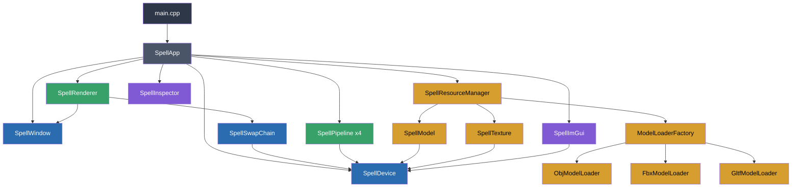
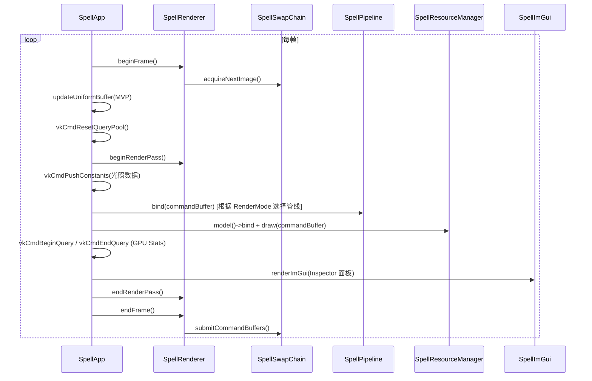

# Spell Engine

一个基于 **Vulkan API** 的轻量级 3D 渲染引擎，使用 C++17 编写。支持多格式模型加载（OBJ / FBX / GLTF）、PBR 材质纹理、Mipmap、MSAA 多重采样抗锯齿、多种渲染模式、ImGui 实时调试面板、GPU Pipeline Statistics 查询以及基础的方向光照。

---

## 功能特性

- **Vulkan 渲染管线** — 完整的图形管线创建，支持动态 Viewport / Scissor
- **多格式模型加载** — 支持 OBJ / FBX / GLTF 格式，通过工厂模式自动选择加载器
- **纹理系统** — 支持图片纹理加载，自动生成 Mipmap，Sampler 过滤
- **MSAA 抗锯齿** — 自动检测 GPU 最大可用采样数，多重采样抗锯齿
- **多渲染模式** — Textured（纹理）/ FlatWhite（白模）/ Wireframe（线框）/ PointCloud（点云）
- **ImGui 集成** — 实时 Inspector 面板，展示渲染统计、GPU Pipeline Statistics、光照参数调节
- **GPU Pipeline Statistics** — 通过 VkQueryPool 查询顶点/图元/着色器调用等 GPU 统计数据
- **Uniform Buffer Object** — MVP 矩阵变换（Model / View / Projection）
- **Push Constants** — 片段着色器中的实时光照参数传递
- **资源管理器** — 统一管理模型与纹理资源的加载、热重载
- **交换链重建** — 窗口大小变化时自动重建 Swap Chain
- **Validation Layer** — Debug 模式下启用 Vulkan 验证层

---

## 项目结构

```
Spell/
├── shaders/                           # GLSL 着色器
│   ├── shader.vert                    # 顶点着色器 (MVP 变换 + PointSize)
│   ├── shader.frag                    # 片段着色器 (纹理采样 + 光照)
│   ├── flat_color.frag                # 纯色片段着色器 (FlatWhite/Wireframe/PointCloud)
│   ├── vert.spv / frag.spv / flat_color_frag.spv  # 编译后的 SPIR-V
│   └── compile.bat                    # 着色器编译脚本
├── textures/                          # 纹理资源
├── models/                            # 模型资源
├── src/
│   ├── main.cpp                       # 入口
│   ├── SpellApp.h/cpp                 # 应用层 (管线布局、描述符、渲染循环)
│   ├── core/                          # 核心 Vulkan 封装
│   │   ├── SpellWindow.h/cpp          # GLFW 窗口管理
│   │   ├── SpellDevice.h/cpp          # Vulkan 设备 (实例/物理设备/逻辑设备/命令池)
│   │   └── SpellSwapChain.h/cpp       # 交换链 (帧缓冲/渲染通道/同步对象/深度/MSAA)
│   ├── renderer/                      # 渲染器
│   │   ├── SpellRenderer.h/cpp        # 帧管理 (beginFrame/endFrame/命令缓冲)
│   │   ├── SpellPipeline.h/cpp        # 图形管线 (着色器模块/管线状态配置)
│   │   └── SpellTypes.h               # 公共类型定义 (UBO/PushConstants/RenderStats)
│   ├── resources/                     # 资源管理
│   │   ├── SpellResourceManager.h/cpp # 资源管理器 (模型+纹理统一管理/热重载)
│   │   ├── SpellModel.h/cpp           # 模型数据 (顶点/索引缓冲，staging buffer)
│   │   ├── SpellTexture.h/cpp         # 纹理加载 (图片读取/Mipmap 生成/采样器)
│   │   ├── IModelLoader.h             # 模型加载器接口
│   │   ├── ObjModelLoader.h/cpp       # OBJ 格式加载器
│   │   ├── FbxModelLoader.h/cpp       # FBX 格式加载器
│   │   ├── GltfModelLoader.h/cpp      # GLTF 格式加载器
│   │   └── ModelLoaderFactory.h/cpp   # 模型加载器工厂
│   └── ui/                            # UI 系统
│       ├── SpellImGui.h/cpp           # ImGui Vulkan 集成
│       └── SpellInspector.h/cpp       # Inspector 调试面板
├── Spell.vcxproj                      # Visual Studio 项目文件
└── Spell.props                        # 依赖库路径配置 (属性表)
```

---

## 架构概览



---

## 渲染流程



---

## 依赖项

| 库 | 用途 | 版本/说明 |
|---|---|---|
| [Vulkan SDK](https://vulkan.lunarg.com/) | 图形 API | 1.4.341.0 |
| [GLFW](https://www.glfw.org/) | 窗口与输入 | lib-vc2019 |
| [GLM](https://github.com/g-truc/glm) | 数学库 (矩阵/向量) | Header-only |
| [stb_image](https://github.com/nothings/stb) | 图片加载 | Header-only |
| [tinyobjloader](https://github.com/tinyobjloader/tinyobjloader) | OBJ 模型加载 | Header-only |
| [cgltf](https://github.com/jkuhlmann/cgltf) | GLTF 模型加载 | Header-only |
| [ufbx](https://github.com/bqqbarbhg/ufbx) | FBX 模型加载 | Header-only |
| [Dear ImGui](https://github.com/ocornut/imgui) | 即时模式 GUI | Vulkan + GLFW backend |

---

## 新设备环境搭建（从零开始）

以下是在一台全新 Windows 设备上搭建完整开发环境的详细步骤。

### Step 1：安装 Visual Studio

1. 下载并安装 [Visual Studio 2019+](https://visualstudio.microsoft.com/)
2. 安装时勾选 **"使用 C++ 的桌面开发"** 工作负载
3. 确认包含 **MSVC v142+** 编译器和 **Windows 10/11 SDK**

### Step 2：安装 Vulkan SDK

1. 前往 [LunarG Vulkan SDK](https://vulkan.lunarg.com/sdk/home) 下载 **1.4.341.0**（或更新版本）
2. 运行安装程序，**默认安装路径**为 `C:\VulkanSDK\1.4.341.0`
3. 安装完成后验证环境变量 `VULKAN_SDK` 已自动设置：
   ```powershell
   echo $env:VULKAN_SDK
   # 应输出: C:\VulkanSDK\1.4.341.0
   ```
4. 验证 GPU 支持 Vulkan：
   ```powershell
   & "$env:VULKAN_SDK\Bin\vulkaninfo.exe" --summary
   ```

### Step 3：准备第三方库

项目所有第三方库统一放在一个目录下（如 `E:\DevLibs`）。仓库中已包含 `DevLibs.zip`，解压即可：

```powershell
# 解压到任意目录，例如 E:\DevLibs
Expand-Archive -Path DevLibs.zip -DestinationPath E:\DevLibs
```

解压后目录结构应为：

```
E:\DevLibs\
├── glfw\
│   ├── include\GLFW\
│   │   └── glfw3.h
│   └── lib-vc2019\
│       └── glfw3.lib
├── glm\
│   └── glm\
│       └── glm.hpp ...
├── stb\
│   └── stb_image.h
├── tinyobjloader\
│   └── tiny_obj_loader.h
├── cgltf\
│   └── cgltf.h
├── ufbx\
│   └── ufbx.h / ufbx.c
└── imgui\
    ├── imgui.h / imgui.cpp ...
    └── backends\
        ├── imgui_impl_glfw.h / .cpp
        └── imgui_impl_vulkan.h / .cpp
```

> **如果不使用 DevLibs.zip**，也可以手动下载各库，按上述结构放置。

### Step 4：配置依赖路径

有两种方式让项目找到第三方库：

**方式一：设置系统环境变量（推荐）**

```powershell
# 设置 DEV_LIBS 环境变量（永久生效）
[System.Environment]::SetEnvironmentVariable("DEV_LIBS", "E:\DevLibs", "User")
```

> 设置后需要**重启 Visual Studio** 才能生效。

**方式二：直接修改 `Spell.props`**

编辑 `Spell.props` 第 11 行，将路径改为你的实际路径：

```xml
<DEV_LIBS Condition="'$(DEV_LIBS)' == ''">你的路径\DevLibs</DEV_LIBS>
```

如果 Vulkan SDK 安装路径非默认，也需修改第 8 行：

```xml
<VULKAN_SDK Condition="'$(VULKAN_SDK)' == ''">C:\VulkanSDK\你的版本号</VULKAN_SDK>
```

### Step 5：克隆项目并打开

```powershell
git clone https://github.com/Spellzzy/VulkanTest.git
cd VulkanTest
```

用 Visual Studio 打开 `Spell.sln`。

### Step 6：编译着色器

着色器需要手动编译一次（后续修改着色器时也需要重新编译）：

```powershell
cd Spell\shaders

# 方式一：直接运行 compile.bat（需先检查里面的 SDK 路径是否正确）
.\compile.bat

# 方式二：手动执行
& "$env:VULKAN_SDK\Bin\glslc.exe" shader.vert --target-env=vulkan1.2 -o vert.spv
& "$env:VULKAN_SDK\Bin\glslc.exe" shader.frag --target-env=vulkan1.2 -o frag.spv
& "$env:VULKAN_SDK\Bin\glslc.exe" flat_color.frag --target-env=vulkan1.2 -o flat_color_frag.spv
```

### Step 7：构建与运行

1. Visual Studio 中选择配置 **`Debug|x64`** 或 **`Release|x64`**
2. 按 **F7** 构建（或 Ctrl+Shift+B）
3. 按 **F5** 运行

### 常见问题排查

| 问题 | 原因 | 解决方案 |
|---|---|---|
| `cannot open file 'vulkan-1.lib'` | Vulkan SDK 路径未配置 | 检查 `VULKAN_SDK` 环境变量或 `Spell.props` 中的路径 |
| `cannot open file 'glfw3.lib'` | DEV_LIBS 路径错误 | 检查 `DEV_LIBS` 环境变量，确认 `glfw/lib-vc2019/glfw3.lib` 存在 |
| `cannot open include file 'vulkan/vulkan.h'` | Vulkan SDK Include 路径缺失 | 重新安装 Vulkan SDK |
| `cannot open include file 'GLFW/glfw3.h'` | GLFW 头文件缺失 | 确认 `DEV_LIBS/glfw/include/GLFW/glfw3.h` 存在 |
| `failed to create Vulkan instance` | GPU 驱动不支持 Vulkan | 更新显卡驱动到最新版本 |
| 着色器相关报错 / 黑屏 | `.spv` 文件缺失或过期 | 重新执行 Step 6 编译着色器 |
| 链接错误 `LNK2019` (ImGui 相关) | ImGui 源文件未加入项目 | 确认 `imgui/*.cpp` 和 `backends/imgui_impl_glfw.cpp`、`imgui_impl_vulkan.cpp` 已在项目中 |

---

## 着色器说明

### 顶点着色器 (`shader.vert`)

- **输入**：位置 (`vec3`)、颜色 (`vec3`)、纹理坐标 (`vec2`)、法线 (`vec3`)、材质索引 (`int`)
- **Uniform**：MVP 矩阵 (`mat4 × 3`) + 相机位置 (`vec3`)
- **输出**：世界空间位置、法线、纹理坐标、材质索引传递给片段着色器
- **PointSize**：写入 `gl_PointSize = 1.0` 以支持 PointCloud 渲染模式

### 片段着色器 (`shader.frag`)

- **纹理采样**：`binding = 1` 的 Combined Image Sampler
- **Push Constants**：光源颜色 (`vec3`) 和位置 (`vec3`)
- **光照模型**：基于法线方向与光线方向的点积，实现简单的漫反射光照

### 纯色片段着色器 (`flat_color.frag`)

- 用于 FlatWhite / Wireframe / PointCloud 模式，输出纯白色

---

## 核心类说明

| 类 | 职责 |
|---|---|
| `SpellWindow` | 封装 GLFW 窗口，处理窗口事件和大小变化回调 |
| `SpellDevice` | 管理 Vulkan 实例、物理/逻辑设备、命令池、队列，提供 Buffer/Image 创建工具方法 |
| `SpellSwapChain` | 交换链管理，包含帧缓冲、渲染通道、深度资源、MSAA 颜色资源、per-image 同步对象 |
| `SpellRenderer` | 帧级别管理，封装 beginFrame/endFrame 流程和命令缓冲分配 |
| `SpellPipeline` | 图形管线封装，加载 SPIR-V 着色器，配置管线各阶段状态 |
| `SpellTypes` | 公共数据类型：UBO、PushConstants、RenderMode 枚举、RenderStats 统计结构 |
| `SpellResourceManager` | 资源管理器，统一管理模型与纹理的加载和热重载 |
| `SpellModel` | 模型数据管理，顶点/索引缓冲（含 staging buffer 优化） |
| `SpellTexture` | 纹理加载（通过 stb_image），Mipmap 自动生成，纹理采样器创建 |
| `IModelLoader` | 模型加载器抽象接口 |
| `ObjModelLoader` | OBJ 格式加载器（tinyobjloader） |
| `FbxModelLoader` | FBX 格式加载器 |
| `GltfModelLoader` | GLTF 格式加载器 |
| `ModelLoaderFactory` | 根据文件扩展名自动选择合适的模型加载器 |
| `SpellImGui` | Dear ImGui 的 Vulkan 后端集成，管理 ImGui 的初始化/渲染/销毁 |
| `SpellInspector` | Inspector 调试面板，展示渲染统计、GPU 管线统计、光照参数等 |
| `SpellApp` | 应用层编排，创建管线布局、描述符、UBO，驱动渲染主循环 |

---

## License

MIT
